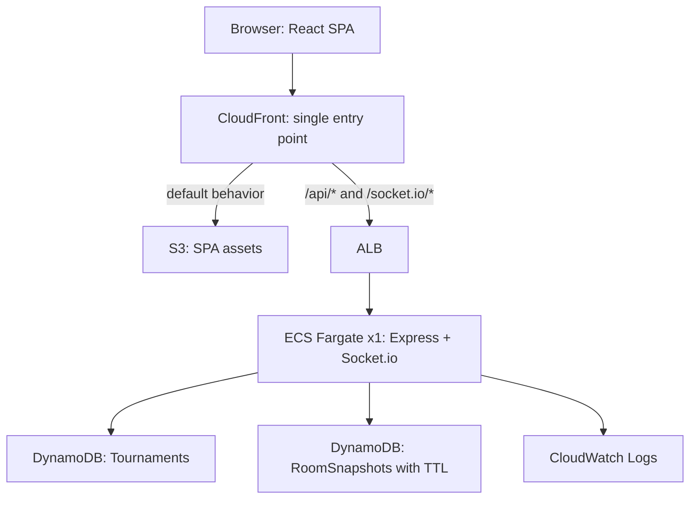
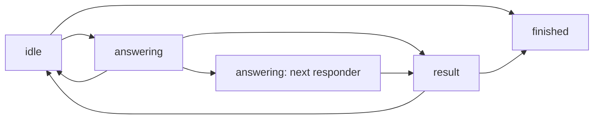
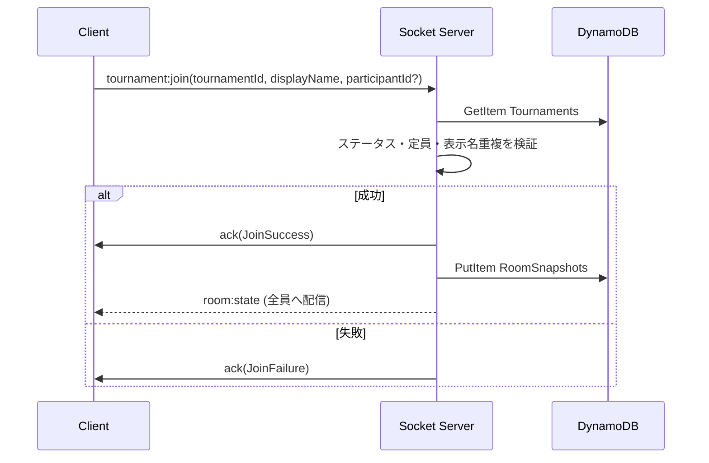

# クイズ大会プラットフォーム設計プラン

この文書が設計の唯一の正とする。実装で迷いが出た場合は本書に従い、本書と実装が食い違った場合は本書を先に更新してから実装を直す。要点だけを読みたい場合はリポジトリ直下の `AGENTS.md` を参照する。

## 前提とゴール

- 想定規模: 1大会あたり数人から数十人
- 最終的な同時開催規模の目標: 同時10大会程度。500接続程度を単一インスタンスで処理する
- リアルタイム要件: 早押し順、回答権、スコア更新を厳密に扱う
- フロントエンド: React + TypeScript
- バックエンド: AWSサービスを主体にする
- 副目的: AWSを実践的に学ぶ。ただしMVPの完成を優先する
- 将来像: 身内での低頻度利用から始め、最終的に一般向けサービスとして公開する

## フェーズ構成

将来は一般公開するが、MVPでは公開サービスに必要な機能を作り込まない。フェーズごとに何を追加し、どの暫定判断を撤回するかを明示する。

### フェーズ0: 身内運用（本プランの実装範囲）

- 参加は招待コードを知っている人のみ
- ホスト認証はホストトークン方式
- ECSタスク数1、HAなし
- 大会がない期間は AppStack を削除して固定費をゼロにする
- CloudFront のデフォルトドメインをそのまま使う
- 手動デプロイ

### フェーズ1: 限定公開

フェーズ0の暫定判断のうち、外部ユーザーが入る時点で撤回が必要なもの。

- **独自ドメインを取得する**: 招待URLが安定して共有できる必要があるため必須。Route53 + ACM を追加し、CloudFront に紐づける
- **常時稼働に切り替える**: `cdk destroy` によるコスト削減をやめる
- CI/CDを整備する: GitHub Actions から ECR push → ECS デプロイ、S3 sync → CloudFront invalidation
- ステージング環境をCDK contextで分離する
- レート制限を有効化する: 早押し連打、招待コードの総当たり、参加試行、表示名変更
- CloudWatch メトリクスを整備する: 同時ルーム数、同時接続数、早押し受信間隔
- 利用規約とプライバシーポリシーを用意する

### フェーズ2: 一般公開

- **Cognito を導入する**: ソーシャルログイン、ホスト別大会一覧、規約同意、不正対応
- 無停止デプロイ: ライブ大会がないノードから順に入れ替える
- 大会結果の永続化（プロダクト判断）: `TournamentResults` テーブルを追加。既存設計に対して加算的で破壊的変更にならない
- 招待コードの厳密な一意性保証: 専用テーブルへの条件付き書き込みに移行する

## アーキテクチャ



### 構成の要点

- フロントエンドは静的SPA。SSRを使わない。招待コードで閉じたアプリなのでSEO要件がない
- バックエンドは1つのNodeプロセス。Express の REST 2本と Socket.io を同居させる
- CloudFront を単一の入口にする。`/api/*` と `/socket.io/*` を ALB オリジンへ、それ以外を S3 オリジンへ振り分ける
- CloudFront を挟むことで、独自ドメインを取得しなくても HTTPS と WSS が使える。CORS設定も不要になる
- `/api/*` と `/socket.io/*` のビヘイビアはキャッシュ無効（CachingDisabled）にし、必要なヘッダーを全て転送する
- ALB のヘルスチェックは `/health` を使う
- ゲーム状態はSocketサーバーのメモリを正とし、DynamoDBへスナップショットを書く

### 単一インスタンス制約とスケール戦略

ゲーム状態がメモリ上にあるため、ECSサービスはタスク数1で固定する。

- 複数タスクにすると早押し順が分裂するため不可
- スティッキーセッションは1タスクなので不要
- Node.js は単一スレッドなので、早押しの受付順は自然に直列化される
- デプロイやタスク再起動で接続は切れるが、DynamoDBスナップショットから自動復旧する
- 運用ルール: 大会開催中はデプロイしない

目標規模である同時10大会・約500接続は、単一インスタンスの**垂直スケール**で対応する。Node.js は数千の WebSocket 接続を扱えるため、タスクのCPUとメモリを引き上げるだけで足りる。フェーズ2までマルチインスタンス化は行わない。

「1大会 = 1つの権威あるプロセスがメモリ上で状態を持つ」という構造は、リアルタイム対戦系サーバーの定石であり、将来も維持する前提の設計とする。

将来マルチインスタンス化が必要になった場合、**Socket.io の Redis アダプタを入れるだけでは不十分**である。Redisアダプタはインスタンス間のブロードキャストを繋ぐだけなので、同じ大会の参加者が別インスタンスに分散すると早押しの受信順を一意に決められない。必要なのは大会単位の所有権とルーティングである。

- 大会ごとに所有ノードを DynamoDB に記録する
- クライアントは接続前に所有ノードを問い合わせ、そのノードへ直接接続する
- 同じ大会の全接続が必ず同一プロセスに集まることを保証する

この層はフェーズ2以降の課題とし、MVPでは実装しない。

### 可用性のトレードオフ

タスク数1のため、タスク障害時は全ライブ大会が中断する。

- ECSがタスクを自動再起動する（数十秒程度）
- クライアントは自動再接続する
- サーバーは DynamoDB スナップショットから状態を復元する
- 最悪ケースで1分程度の中断となる

クイズ大会という性質上この中断は許容できると判断し、MVPおよびフェーズ1ではHA構成を採らない。

### 却下した選択肢

**API Gateway WebSocket + Lambda**
アイドルコストがゼロになる利点はあるが、早押し1回ごとに Lambda 起動と DynamoDB 条件付き書き込みが入る。コールドスタートが最初の早押しの公平性を直撃し、全員への状態配信も接続数ぶんの `postToConnection` 呼び出しになる。「厳密な早押し順」という中核要件と衝突するため採用しない。

**AWS App Runner**
WebSocket 非対応。さらに2026年4月から新規顧客に対して閉じられ、機能追加も行われない。AWS自身が ECS への移行を案内している。

**Next.js + Amplify Hosting + Route Handlers**
HTTP APIが2本しかないのに実行環境が2つに分かれ、IAMロール、ログ、デプロイ、バリデーションが二重化する。SSRの利点も効かない。Socketサーバー側にAPIを集約する方が単純で、フロント用フレームワークがAPIを持つ構造上の違和感も解消される。

**ホストブラウザからの状態復旧**
クライアントが送るスコアや参加者リストを信用することになり、「ゲームの正しさはサーバーが持つ」原則に反する。DynamoDBスナップショットに置き換える。

### 一方通行を避けるための仕込み

将来の一般公開に向けて、実装コストをほとんど増やさずに後戻りを防げる項目だけMVPに入れる。

- **ルーム状態アクセスを所有権つきインターフェースに閉じる**: `RoomRegistry` を経由して大会状態を取得し、「このプロセスがこの大会の所有者か」という概念を最初から持たせる。マルチインスタンス化時にゲームロジックを書き換えずに済む
- **`Tournaments` に `hostAccountId` を予約する**: Cognito導入時に埋まる nullable フィールドとして最初から定義しておく
- **Socketハンドラにレート制限のフックを1箇所用意する**: MVPでは実質無制限の閾値を設定し、フェーズ1で値を絞るだけにする
- **招待URLのベースURLを設定値から組み立てる**: ドメイン変更に耐えるため、コード内にホスト名を埋め込まない
- **ログを構造化JSONで出力する**: 後から CloudWatch Logs Insights でメトリクス抽出できるようにする
- **リージョンは `ap-northeast-1` 固定とする**: 早押しの公平性は同一リージョン内接続を前提とする。マルチリージョン展開時は大会をリージョンに固定する必要がある点を既知の制約として記録する

逆に、以下はMVPでは実装しない。固定費と実装複雑度が増える一方で、動くゲームがない段階では最適化する対象が存在しないため。

- マルチインスタンス構成とノードルーティング層
- ElastiCache / Redis アダプタ
- オートスケーリング
- マルチリージョン展開

## リポジトリ構成

クライアントとサーバーで Socket イベント型とバリデーションを共有するため、npm workspaces のモノレポにする。

```
apps/web        # Vite + React + TypeScript (SPA)
apps/server     # Express + Socket.io
packages/shared # ドメイン型、Socketイベント型、バリデーション
infra           # AWS CDK (TypeScript)
```

- ドメインモデルは `packages/shared/src/types` に集約する
- `packages/shared` はビルドせず、`exports` からTypeScriptソースを直接公開する。利用側のバンドラと tsx がそのまま解決する
- モジュール解決は `bundler` にする。相対importに `.js` 拡張子を付けずに書けるが、Nodeで直接実行はできない。本番のサーバーイメージは esbuild でバンドルするか tsx 経由で起動する（ステップ21で確定させる）
- 各ワークスペースで Vitest を設定し、TDDで進める
- 全ファイル冒頭に英語で仕様コメントを書く
- 型には英語のjsdocコメントで用途を記述する

## MVP機能スコープ

### ユーザーロール

`Host` と `Participant` の2種類のみ。観戦者、共同出題者、管理者は対象外。

- `Host`: 大会作成、正誤判定、得点入力、進行操作、大会終了、ルームクローズ
- `Participant`: 参加、退出、早押し、テキスト回答送信、表示名変更、ホスト引き継ぎ

### 問題管理はアプリ外

アプリ内に問題管理機能を持たない。

- 問題文、正答候補、解説はアプリ外の資料で管理する
- ホストは外部資料を見ながら読み上げる
- アプリは早押し、回答権、テキスト回答、判定、スコア管理に集中する
- 問題文はホスト画面にも参加者画面にも表示しない
- アプリは「どの問題を読んでいるか」を一切管理しない

### 回答方式

早押しを前提に、常に次の2つを併用できる。

- 口頭回答: 回答権保持者が外部VCアプリで口頭回答する
- テキスト回答: 回答権保持者がアプリ上でテキスト送信する

buzz session ごとに方式を選択しない。ホストが運用で使い分ける。外部VCとのAPI連携は行わない。

### チャット機能はMVP外

アプリ内チャットは実装しない。参加者間の会話は外部VCで行う。

### 参加方式

- 公開ルーム一覧は作らない
- 参加者はログイン不要。表示名の入力のみ
- 招待コードはシステムが8文字で自動生成する
- 招待URLは招待コードをパラメーターに持つ
- 招待コードだけを直接入力する画面も用意する
- 大会は作成直後から参加可能。「大会開始」という操作は存在しない
- 途中参加と途中退出を許可する。途中参加者はスコア0から始まる
- 退出者のスコアと表示名はルーム内に残す
- 同じ大会内で表示名の重複は許可しない
- 再参加はブラウザ保存の参加者IDで同一人物として復帰する
- 定員チェックは新規参加のみ。既存参加者IDの復帰は定員超過でも許可する

### ゲーム状態

MVPの状態は5つ。

```ts
/**
 * Progress state of a tournament room.
 * Owned by the socket server and broadcast to all clients.
 */
export type GameStatus =
  | "idle"       // No current responder. Participants can buzz.
  | "answering"  // A responder holds the answer right.
  | "result"     // Showing the judgement of the last answer.
  | "paused"     // Suspended, typically because the host disconnected.
  | "finished";  // Tournament ended.

/**
 * Reason why the room was paused.
 */
export type PausedReason = "hostDisconnected";
```

### 進行フロー

ホスト主導の手動進行。タイマーは使わない。



- `idle` で最初の早押しが受理されると、サーバーが `buzzSession` を自動開始し `answering` へ移る
- 最初に受理された参加者が回答権を得る
- `answering` 中も未早押しの参加者は早押しできる。順番だけ記録される
- 同じ `buzzSession` 内で同じ参加者の早押しは1回だけ受理する
- ホストは `judge:submit` で正誤、得点、次アクションを1操作で確定する
- 次アクションは `showResult`、`resetToIdle`、`moveToNextResponder` の3つ
- `judge:submit` を受理するのは `answering` のみ。`showResult` で `result` へ移ったあと、結果表示を閉じて `idle` に戻す操作は `game:reset` という別イベントにする。`judge:submit` は必ず得点加算を伴うので、結果画面から次へ進むだけの操作に流用すると二重加点の経路ができる
- 大会終了はホストが任意のタイミングで実行する

### 早押しの公平性

- 早押し順はクライアント時刻ではなくサーバー受信順を正とする
- 通信環境によって順序に差が出る可能性があることを参加者向けに明記する
- ホストは読み上げ前のボタンチェックも正式な早押しとして扱える
- `result` 状態での押下は正式な早押しとして扱わない
- `paused`、`finished`、接続切れでは操作を止める

押下を受理する条件と、拒否したときの扱いを次のように定める。拒否はすべて `INVALID_STATE` で返す。早押しに固有のエラーコードは増やさない。参加者から見た「今は押せない」は1種類で足りるし、コードを細かく分けるほどクライアントが状態を推測する余地が増えるため。

- 受理するのは `idle` と `answering` のみ。`idle` での押下が `buzzSession` を自動開始し、押した本人が回答権を得る
- `answering` 中の押下は `buzzOrder` への追記だけを行う。回答権は移らない
- 同一 `buzzSession` 内での同一参加者の2回目以降は拒否する。状態は変えないので再配信も起きない。連打が全員へのブロードキャストに化けないようにするため
- ホスト席からの押下は受理しない。判定する側が回答権を持つ状態を作らない
- ルームに席がない送信者の押下は受理しない

### 判定と得点

- 正誤判定はホストの手動判定のみ。自動判定は行わない
- 得点は判定時にホストが入力する。問題側に配点を持たない
- クイックボタン（`+1`, `0`, `-1`）と任意数値の手入力を併用する
- 不正解時の減点も可能。スコアは負値になり得る
- 判定後、参加者には正誤と得点変動を表示する
- 送信済みテキスト回答は判定前はホストのみ、判定後は全員に見せる
- 回答が未送信でもホストは判定へ進める

### 画面構成

- 大会作成画面: 大会名と最大参加人数を入力し、招待コードと招待URLを確認する
- 招待コード入力画面: コードを直接入力して参加画面へ進む
- 参加者名前入力画面: 大会名を表示し、表示名だけを入力する
- 参加者プレイ画面: 参加者一覧、早押し順、スコアを中心に表示。早押しボタンを下部固定、回答入力欄を常設
- ホスト進行画面: 参加者一覧、接続状態、スコア、早押し順を中心に表示。状態に応じた操作ボタンを下部に表示
- 最終結果画面: 優勝者を強調表示。同点1位は全員を優勝者として表示。ホスト席は出題者なので順位に含めない

参加者画面は状態が変わっても基本レイアウトを維持する。ホスト画面の操作ボタンは状態ごとに絞る。

- `idle`: スコア確認、大会終了
- `answering`: 正誤、点数入力、次アクション選択
- `result`: `game:reset`（次の問題へ）、大会終了
- `paused`: 引き継ぎ・再接続状態の表示のみ
- `finished`: 最終結果表示、ルームクローズ

## RoomState設計

サーバー内部では1種類の状態を正とし、参加者向けに送る際だけ情報を絞る。

```ts
/**
 * Authoritative in-memory room state owned by the socket server.
 */
export type InternalRoomState = {
  tournamentId: string;
  status: GameStatus;
  /** Status to restore when resuming from a pause. */
  statusBeforePause?: GameStatus;
  pausedReason?: PausedReason;
  /** Participant id currently holding host authority. */
  hostId: string;
  hostOnline: boolean;
  participants: ParticipantState[];
  currentBuzzSession?: BuzzSessionState;
  /** Buzz entries in server-received order. Index is the rank. */
  buzzOrder: BuzzEntry[];
  currentResponderId?: string;
  currentSubmittedAnswer?: SubmittedAnswerState;
  lastResult?: LastResultState;
  updatedAt: number;
};

/**
 * A quiz participant. Derived display values are not stored here.
 */
export type ParticipantState = {
  id: string;
  name: string;
  online: boolean;
  joinedAt: number;
  score: number;
};

/**
 * A unit of buzz handling, from the first buzz to the judgement.
 */
export type BuzzSessionState = {
  id: string;
  startedAt: number;
};

/**
 * A single accepted buzz. Rank is the array index in buzzOrder.
 */
export type BuzzEntry = {
  participantId: string;
  receivedAt: number;
};

/**
 * The latest text answer submitted by the current responder.
 */
export type SubmittedAnswerState = {
  participantId: string;
  answerText: string;
  receivedAt: number;
};

/**
 * Minimal judgement result kept only for the result screen.
 */
export type LastResultState = {
  participantId: string;
  isCorrect: boolean;
  scoreDelta: number;
};

/** State sent to the host. */
export type HostRoomState = InternalRoomState;

/**
 * State sent to participants.
 * currentSubmittedAnswer is included only while status is "result".
 */
export type ParticipantRoomState = Omit<InternalRoomState, "currentSubmittedAnswer"> & {
  currentSubmittedAnswer?: SubmittedAnswerState;
};
```

### 派生値を持たない方針

クライアントで計算できる値は `RoomState` に持たない。

- 優勝者: `participants` の最高スコアから計算する。ホスト席（`hostId`）は除く
- ランキング順位: `participants` を `score` 降順に並べて計算する。同点は同順位にする
- 早押し順位: `buzzOrder` の配列インデックスから計算する
- `isHost`: `hostId === participant.id` で計算する
- `hasBuzzed`: `buzzOrder` に参加者IDが含まれるかで計算する
- `isCurrentResponder`: `currentResponderId` との一致で計算する
- 判定後の合計点: `participants[].score` を参照する

### 参加者向け変換

参加者へ送る際は必ずサーバー側の変換関数を通す。

- `status` が `result` 以外のとき `currentSubmittedAnswer` を除外する
- それ以外のフィールドはホスト向けと同じものを配信する
- `hostId` と `currentBuzzSession.id` は隠さない

### リセット規則

- `showResult`: `lastResult` をセットし、`currentBuzzSession`、`buzzOrder`、`currentResponderId` をリセットして `result` へ。`currentSubmittedAnswer` は残す。結果画面で全員に見せるのが目的だから
- `resetToIdle`: `lastResult` と `currentSubmittedAnswer` を削除し、`currentBuzzSession`、`buzzOrder`、`currentResponderId` もリセットして `idle` へ。`buzzOrder` を残すと、前の問題で押した人が次の問題で押せなくなる
- `moveToNextResponder`: `buzzOrder` の次の参加者へ回答権を移す。`currentSubmittedAnswer` はリセットする。`currentBuzzSession` と `buzzOrder` は同じ問題の続きなので保持する。オフラインの参加者を飛ばすことはしない。飛ばす条件をサーバーが判断し始めると、ホストの進行と食い違う
- 次候補がいない場合は `NO_NEXT_RESPONDER` エラーを返し、状態は変えない。得点も加算しない
- `game:reset`: `result` を閉じて `idle` へ戻す。リセット範囲は `resetToIdle` と同じで、スコアには触らない
- `tournament:finish`: `resetToIdle` と同じ範囲をリセットしてから `finished` へ。最終結果はスコアだけを見せるので、直前の判定や回答テキストを残さない

## Socketイベント設計

操作ごとに個別イベントを定義する。状態同期は操作のたびに `room:state` で全体を配信する。

### クライアントからサーバー

```ts
/** Host connects to the room using the host token issued at creation. */
type TournamentHostJoinPayload = {
  tournamentId: string;
  hostToken: string;
};

/** Participant joins as a guest. participantId is sent when rejoining. */
type TournamentJoinPayload = {
  tournamentId: string;
  displayName: string;
  participantId?: string;
};

type TournamentLeavePayload = Record<string, never>;

type ParticipantRenamePayload = {
  displayName: string;
};

/** Any online participant can claim host authority while paused. */
type HostClaimPayload = Record<string, never>;

type BuzzPayload = Record<string, never>;

type AnswerSubmitPayload = {
  answerText: string;
};

type JudgeSubmitPayload = {
  participantId: string;
  isCorrect: boolean;
  scoreDelta: number;
  nextAction: "showResult" | "resetToIdle" | "moveToNextResponder";
};

/** Host closes the result screen and reopens buzzing. Carries no judgement. */
type GameResetPayload = Record<string, never>;

type TournamentFinishPayload = Record<string, never>;

type RoomClosePayload = Record<string, never>;
```

### サーバーからクライアント

```ts
/** Full room state after every accepted state change. */
type RoomStateEvent = HostRoomState | ParticipantRoomState;

/** The room was closed by the host. */
type RoomClosedEvent = {
  reason: "hostClosed";
};

/** A newer connection took over this participant id. */
type SessionInvalidatedEvent = Record<string, never>;

/** An operation was rejected. */
type SocketErrorEvent = {
  code: SocketErrorCode;
  message: string;
};
```

### ack方針

参加・権限系のイベントだけ ack コールバックで即時結果を返す。それ以外は ack を使わず、`room:state` と `error` で伝える。

- ack を使う: `tournament:host-join`、`tournament:join`、`participant:rename`、`host:claim`
- ack を使わない: `tournament:leave`、`game:buzz`、`answer:submit`、`judge:submit`、`game:reset`、`tournament:finish`、`room:close`

失敗形式は4イベントで共通にする。成功形式だけイベントごとに定義する。

```ts
/** Shared failure shape for every acknowledged event. */
type AckFailure = {
  ok: false;
  code: SocketErrorCode;
  message: string;
};

type JoinSuccess = {
  ok: true;
  role: "host" | "participant";
  participantId: string;
  isReconnect: boolean;
};

type JoinResponse = JoinSuccess | AckFailure;

/** Echoes the normalised name the server actually stored. */
type RenameSuccess = {
  ok: true;
  displayName: string;
};

type RenameResponse = RenameSuccess | AckFailure;

/** hostId is the new host, which is always the caller. */
type HostClaimSuccess = {
  ok: true;
  hostId: string;
};

type HostClaimResponse = HostClaimSuccess | AckFailure;
```

参加失敗時の ack に `RoomState` を含めない。参加を拒否した相手に参加者名やスコアを渡さないため。既存参加者の無効操作に対しては `error` を返した後、最新の `room:state` を再配信する。

### エラーコード

```ts
export type SocketErrorCode =
  | "UNAUTHORIZED"            // Host token mismatch
  | "VALIDATION_ERROR"        // Malformed payload
  | "TOURNAMENT_NOT_FOUND"
  | "TOURNAMENT_NOT_JOINABLE" // Tournament is closed
  | "TOURNAMENT_FULL"
  | "DUPLICATE_DISPLAY_NAME"
  | "NOT_HOST"                // Host-only operation by a participant
  | "NOT_CURRENT_RESPONDER"   // Answer submitted without the answer right
  | "INVALID_STATE"           // Operation not allowed in the current status
  | "NO_NEXT_RESPONDER"       // moveToNextResponder with an empty queue
  | "STALE_CONNECTION"        // Operation from a superseded connection
  | "INTERNAL_ERROR";
```

### 参加フロー



### 検証ルール

`tournament:host-join`

- `hostToken` をハッシュ化し、DynamoDB の `hostTokenHash` と比較する
- 大会ステータスは `active` と `closed` の両方で接続を許可する（終了後の結果表示のため）
- ホスト権限が既に他の参加者へ移っている場合は `UNAUTHORIZED` を返し、参加者として `tournament:join` させる
- 成功時は `role: "host"` を返し、`paused` なら `statusBeforePause` へ復帰させる

`tournament:join`

- `displayName`: 前後の空白を除去して1〜20文字
- 大会ステータスが `active` であること。`closed` は `TOURNAMENT_NOT_JOINABLE`
- 定員: 新規参加のみ `participants.length < maxParticipants` を確認する
- 表示名重複: 同一大会内の他参加者と重複不可
- 再参加: `participantId` が既存参加者と一致すれば復帰し `isReconnect: true` を返す
- 新規参加: サーバーがUUIDで `participantId` を発行する
- 成功後、クライアントは `participantId` をブラウザに保存する

`participant:rename`

- 表示名の制約は参加時と同じ
- 重複する表示名には変更できない
- 参加者IDとスコアは維持する
- 大会中いつでも可能

`host:claim`

- `status` が `paused` かつ `pausedReason` が `hostDisconnected` のときのみ許可する
- オンラインの参加者だけが実行できる
- 最初にサーバーで受理された1件のみ有効。以降は `INVALID_STATE`
- 成功後、`hostId` を新ホストに変更し `statusBeforePause` へ復帰する

`judge:submit`

- ホストのみ。ホスト席以外からの送信は `NOT_HOST`
- 受理するのは `answering` のみ。それ以外は `INVALID_STATE`。有効な `currentBuzzSession` があるのはこの状態だけである
- ペイロードの `participantId` は判定対象であり送信者ではない。`currentResponderId` と一致しない場合は `INVALID_STATE` を返す。ホスト画面が古い状態のまま判定したとき、回答権が移ったあとの参加者に得点が入るのを防ぐため
- `scoreDelta` を対象参加者の `score` に加算する。`isCorrect` とは独立に扱い、正解に0点、不正解に減点も許す

`game:reset`

- ホストのみ。`status` が `result` のときだけ受理する。それ以外は `INVALID_STATE`
- スコアと参加者一覧には触らない

`tournament:finish`

- ホストのみ。ホスト席以外からの送信は `NOT_HOST`
- 受理するのは `idle` と `result` のみ。それ以外は `INVALID_STATE`。回答権を持ったままの参加者を残して終了させない
- メモリ上の状態を `finished` にしたあとで、`Tournaments` のステータスを `closed` に更新する。DynamoDB への書き込みが失敗しても終了は取り消さない。ゲームの正はメモリ側であり、DBの一時障害で進行が止まるほうが害が大きい
- 上の順序だと書き込み失敗時に「メモリは終了、DBは `active`」になりうるので、新規参加は大会ステータスだけでなくメモリ上の `finished` でも拒否する。既存参加者の再接続は結果を見せるために許可する

`room:close`

- ホストのみ。`status` が `finished` のときだけ受理する。それ以外は `INVALID_STATE`
- 全員に `room:closed` を送ってから接続を切り、サーバーはルームの所有権を手放す

`answer:submit`

- 受理するのは `answering` のみ。他の状態での送信は `INVALID_STATE` を返す。回答権を持ちうる状態が `answering` しかない以上、状態の不一致は回答権の有無より手前の話であり、`NOT_CURRENT_RESPONDER` を返すと「回答権さえあれば送れる状態だった」と誤読させる
- `answering` 中に `currentResponderId` と一致しない参加者が送った場合だけ `NOT_CURRENT_RESPONDER` を返す。ホスト席からの送信もここに含まれる（ホストは早押しできないので `currentResponderId` になり得ない）
- 空文字と空白のみは拒否する。回答テキストの検証は表示名と同じ共有バリデーターで行い、失敗は `VALIDATION_ERROR` にする。状態を読む前に弾くので再配信もしない
- 同じ `buzzSession` 中の再送は上書きする。保持するのは最新の1件だけで、送信履歴は持たない
- 受信時刻はサーバー時刻を使う

### 再接続と多重接続

- 参加者IDはブラウザに保存し、ユーザーが消すまで保持する
- 同じ参加者IDで新しい接続が来た場合、新しい接続を有効にする
- 古い接続には `session:invalidated` を送り、以降の操作は `STALE_CONNECTION` で拒否する
- ホスト切断を検知したら `paused` にし、`statusBeforePause` に直前の状態を保存する
- 参加者切断時は `online: false` にし、スコアと表示名を維持する
- ホスト変更後に旧ホストが戻った場合は通常の参加者として扱う

## HTTP API

Socketサーバー上の Express が提供する。Next.js は使わない。

- `POST /api/tournaments`: 大会を作成し、招待コードとホストトークンを返す。成功時は `201`
- `GET /api/tournaments/by-invite-code/:code`: 招待コードから大会名と参加可否を返す
- `GET /health`: ALBのヘルスチェック用

エラーコードとHTTPステータスの対応は1箇所（`apps/server/src/api/errors.ts`）に持ち、ハンドラごとに決めない。同じコードが呼び出し場所によって違うステータスになることを防ぐため。

| コード | ステータス |
| --- | --- |
| `VALIDATION_ERROR` | 400 |
| `TOURNAMENT_NOT_FOUND` | 404 |
| `TOURNAMENT_NOT_JOINABLE` | 409 |
| `INTERNAL_ERROR` | 500 |

リクエストボディは 8KB までとする。JSONとして壊れているボディやサイズ超過は `500` ではなく `400` と `VALIDATION_ERROR` で返す。呼び出し側の誤りだから。

例外はハンドラで捕まえずエラーミドルウェアに集約する。クライアントへ返すメッセージは固定文言にし、原因はログにのみ書く。このエンドポイントは誰でも叩けるため、例外メッセージがテーブル名や保存値を含んで漏れることを避ける。

```ts
type CreateTournamentRequest = {
  name: string;
  maxParticipants: number;
};

export type TournamentStatus = "active" | "closed";

/**
 * Tournament settings as exposed to clients. Carries no credentials.
 */
export type Tournament = {
  id: string;
  name: string;
  maxParticipants: number;
  inviteCode: string;
  status: TournamentStatus;
  createdAt: number;
  updatedAt: number;
};

/**
 * Persisted shape. Must never leave the server: convert to Tournament first.
 * hostAccountId is reserved for the phase 2 Cognito integration and is always unset in the MVP.
 */
export type TournamentRecord = Tournament & {
  hostTokenHash: string;
  hostAccountId?: string;
};

/** hostToken is returned only once, at creation time. */
type CreateTournamentResponse = {
  tournament: Tournament;
  inviteUrl: string;
  hostToken: string;
};

type ResolveInviteCodeResponse = {
  tournamentId: string;
  name: string;
  status: TournamentStatus;
  canJoin: boolean;
};

type ApiErrorCode =
  | "VALIDATION_ERROR"
  | "TOURNAMENT_NOT_FOUND"
  | "TOURNAMENT_NOT_JOINABLE"
  | "INTERNAL_ERROR";

type ApiErrorResponse = {
  code: ApiErrorCode;
  message: string;
};
```

### 入力バリデーション

- 大会名: 前後の空白を除去して1〜50文字
- 表示名: 前後の空白を除去して1〜20文字
- 回答テキスト: 前後の空白を除去して1〜200文字
- 最大参加人数: 2〜50の整数。数値文字列は暗黙に変換せず拒否する
- 得点変動: -999〜999の整数。数値文字列は拒否する。上下限はゲームルールではなく歯止めであり、`NaN` や桁を打ち間違えた値がスコアに入ると、順位計算まで含めて後から直せなくなるため設ける
- 文字数は前後の空白を除去したあとに数える。空白で埋めて上限を超えられないようにする
- 大会名・表示名・回答テキストは制御文字（改行やタブを含む）を拒否する。いずれも一行入力であり、改行が混ざると参加者一覧やホスト画面の表示が全員分崩れるため
- ゼロ幅文字は拒否しない。除外すると絵文字の結合列も壊れるため。ゼロ幅文字を使った表示名の視覚的な重複はフェーズ1以降の課題として残す
- 不正な入力は `400` と `VALIDATION_ERROR`
- クライアントとサーバーで同じ制約を検証する。正式な判定はサーバー
- バリデーション関数は `packages/shared` に置き、両者で共有する
- 検証関数は例外を投げず `ValidationResult<T>` を返す。成功時は正規化済みの値を返し、呼び出し側はその値を保存する
- エラーメッセージの日本語コピーは検証関数側に持つ。クライアントはフォーム直下に、サーバーは `ApiErrorResponse.message` と `SocketErrorEvent.message` に同じ文言を載せる

### 招待コード

- 8文字のコードをシステムが自動生成する
- 使う文字は `23456789ABCDEFGHJKLMNPQRSTUVWXYZ` の32文字。`0/O` と `1/I` を除いてある。音声通話で読み上げて打ち直せることを条件にする
- 32文字ちょうどにしているのは偶然ではない。256が32で割り切れるため、ランダムな1バイトを剰余で写しても分布が偏らず、再抽選ループが要らない
- 乱数源は引数で受け取る。`packages/shared` を実行環境に依存させないため、サーバーが `node:crypto` 由来の関数を渡す
- 大文字小文字を区別せず、保存・検索時に正規化する
- `inviteCode-index` で衝突を確認し、衝突時は再生成する。最大5回試して駄目なら `INTERNAL_ERROR` を返す。無限ループにしない
- GSIは結果整合性のため厳密な一意性保証にはならないが、十分なコード空間で実用上無視できる水準にする
- 招待コード自体に認証能力を持たせない。参加時にステータスと定員を再検証する

招待URLは `{PUBLIC_BASE_URL}/join?code=XXXXXXXX` の形にする。コードをパスではなくクエリパラメーターに置くことで、`/join` という1つのルートが両方の入口を兼ねる。コード付きなら表示名入力へ直行し、コードなしならコードを手入力する画面を出す。

### `canJoin` の意味

`canJoin` は大会ステータスから算出する公開情報のみで判断する。`active` なら `true`、`closed` なら `false`。終了済みの大会でも大会名は返す（参加画面で「終了しています」と出せるようにするため）。現在人数を含む最終的な参加可否はSocket参加時に再検証する。

招待コードの形式が不正なときは DB を引かず `VALIDATION_ERROR` を返す。正しい形式で見つからないときだけ `TOURNAMENT_NOT_FOUND` にする。不正な長さのコードに 404 を返すと、どの文字までが有効かに近い情報を総当たりに渡すため。

## 認証

### MVP: ホストトークン方式

Cognitoは使わない。

- 大会作成時にサーバーが32バイトのランダムトークンを生成し、base64url で符号化する
- レスポンスで1度だけ平文を返し、DynamoDBには SHA-256 ハッシュのみ保存する
- ハッシュは bcrypt や argon2 ではなく素の SHA-256 でよい。パスワードハッシュが意図的に遅いのは、推測可能な秘密に対する総当たりを遅らせるため。このトークンは CSPRNG 由来の256ビットであり推測対象が存在しないので、遅くする意味がない。ハッシュ化の目的はDBダンプが流出しても全大会の操作権を渡さないことだけ
- ホストのブラウザは `tournamentId` をキーにトークンを保存する
- `tournament:host-join` でトークンを提示し、サーバーがハッシュを比較する
- トークンを失った場合はホスト引き継ぎ機能で回復する
- 参加者は認証なし。参加時のサーバー検証のみ

この方式により、ユーザーアカウント、ソーシャルIdP設定、JWT検証、「本番と開発で認証経路が違う」問題がすべて不要になる。

### フェーズ2: Cognito

ゲームが動作した後に追加する。

- User Pool とソーシャルIdP（Google）を設定する
- 予約済みの `hostAccountId` に Cognito の `sub` を格納する
- ホスト別大会一覧を提供する（`hostAccountId` GSI を追加）
- ホストトークン方式はローカル開発用および端末バインドとして残す
- 既存の `hostAccountId` が未設定の大会はトークン認証のまま動作させ、移行を加算的にする

## DynamoDB設計

MVPでは2テーブル構成にする。

### `Tournaments`

- パーティションキー: `id`
- GSI: `inviteCode-index`（パーティションキー `inviteCode`）
- 属性: `name`, `maxParticipants`, `inviteCode`, `status`, `hostTokenHash`, `hostAccountId`, `createdAt`, `updatedAt`
- `hostAccountId` はフェーズ2のCognito導入に備えた予約フィールド。MVPでは常に未設定
- ステータスは `active` と `closed` の2種類。作成直後は `active`
- `RemovalPolicy.RETAIN` を設定し、スタック削除時もデータを残す

アクセスパターン

- 大会IDから設定を取得: `GetItem`
- 招待コードから設定を取得: `Query` on `inviteCode-index`
- 大会作成: `PutItem`（`attribute_not_exists(id)` 条件つき。IDはUUIDなので衝突は実質バグであり、そのバグが進行中の大会を消せないようにする）
- 大会終了時にステータス更新: `UpdateItem`

上記4つ以外のアクセスパターンをリポジトリに生やさない。汎用の `find` やクエリビルダーを置くと、キー設計で支えられるかを確認しないまま新しい読み方が増えるため。

テーブルはスキーマレスであり、過去のデプロイが書いた項目が残りうる。読み出しはキャストせず必ず検証を通し、形が合わなければその場で例外にする。フィールド名だけをエラーに載せ、値は載せない（ひとつはトークンハッシュのため）。

### `RoomSnapshots`

サーバー再起動時の復旧用。

- パーティションキー: `tournamentId`
- 属性: `state`（`InternalRoomState` のJSON）, `updatedAt`, `expiresAt`
- TTL属性は `expiresAt`。24時間で自動削除する
- `RoomState` が変わるたびに書き込む。連続変更に備えて200msデバウンスする
- サーバー起動時、または大会への最初の接続時に読み戻す
- 大会終了・ルームクローズ時に削除する

書き込み量は1大会あたり数百件程度で、オンデマンド課金では実質無料。TTLで自動削除されるため「大会結果を永続保存しない」方針も守れる。

### 保存しないもの

- 問題文、正答候補
- 回答履歴、チャット、ホスト操作ログ、スコア推移
- 最終結果（結果画面は終了時点のメモリ状態から表示する）

トラブルシュート用のサーバーログは CloudWatch に残す。

### 責務分担

- DynamoDB: 大会設定の永続化と、復旧用スナップショット
- Socketサーバー: 早押し順、回答権、スコア、状態遷移。ゲームの正しさに関わる全て
- クライアント: 順位、優勝者、早押し済み表示などの派生値の計算

ゲーム結果を変えるロジックはクライアントに置かない。

## インフラ（CDK）

TypeScriptのCDKで2スタックに分ける。

### PersistentStack

- DynamoDB `Tournaments`（RETAIN）
- DynamoDB `RoomSnapshots`（RETAIN）
- ECR リポジトリ

### AppStack

- VPC（パブリックサブネットのみ。NAT Gatewayは使わない）
- ALB（HTTP リスナー、ターゲットは Fargate）
- ECS クラスター、タスク定義、サービス（desiredCount: 1、パブリックIP付与）
- S3 バケット（SPA、OACでCloudFrontからのみアクセス可）
- CloudFront ディストリビューション（S3 と ALB の2オリジン）
- CloudWatch ロググループ（保持期間は短く設定）

### コスト運用（フェーズ0限定）

- 大会がない期間は `cdk destroy` で AppStack を削除する。ALBの固定費（月$16〜22）とFargate費用がゼロになる
- PersistentStack は残すのでデータは失われない
- AppStack を作り直すと CloudFront のドメインが変わる。招待URLは大会ごとに発行するため、身内運用では問題にならない
- NAT Gateway は月$32以上かかるため使わない。Fargateはパブリックサブネットから ECR を取得する

この運用はフェーズ0限定である。外部ユーザーが入る時点で、Route53 + ACM で独自ドメインを固定し、常時稼働へ切り替える。招待URLが作り直しで無効になる状態は公開サービスとして成立しない。

### セキュリティ

- ALBのセキュリティグループは CloudFront のマネージドプレフィックスリストからのみ許可する
- CloudFront から ALB への通信は MVP では HTTP とする。独自ドメイン導入時に HTTPS へ移行する
- ECSタスクロールに、2テーブルへの最小権限のみ付与する
- ホストトークンはハッシュのみ保存する

## ローカル開発環境

AWSにデプロイせずに全機能を動作確認できるようにする。

- `npm run db:up` で DynamoDB Local を起動する（Docker Compose）
- サーバー起動時にテーブルの存在を確認し、なければ自動作成する。ただし `DYNAMODB_ENDPOINT` が設定されているときだけ。AWS上ではテーブルはCDKの `PersistentStack` が持ち、タスクロールに作成権限を与えない。設定漏れのタスクが本番にテーブルを作ってしまう経路を塞ぐ
- Vite の dev server で `/api`・`/health`・`/socket.io` をローカルサーバーへプロキシする。`/api` と `/socket.io` は本番のCloudFront構成と同じパス構造。`/health` は ALB ヘルスと同じパスをブラウザから確認するためのローカル用
- `npm run dev` でDocker Compose、Viteサーバー、Socketサーバーをまとめて起動する
- `npm run db:reset` でローカルDynamoDBのデータをリセットする（ボリュームごと作り直す）。テーブルも消えるのでサーバーの再起動が要る。テーブル作成を起動時の1回に限っているのは、リクエストのたびに存在確認する作りにすると、本番でも同じ経路が動きうるため
- 中身の確認は `npm run db:tables` / `npm run db:scan`（要 AWS CLI）か、`npm run db:admin`（ブラウザ GUI）を使う。いずれも Local 向けのエンドポイントとダミー認証をスクリプトが渡す
- 環境変数は `.env.local` に集約する。`.env.example` を写して使う

必要な環境変数

- `PORT`: Socketサーバーのポート（既定 3001）
- `LOG_LEVEL`: `debug` / `info` / `warn` / `error`（既定 `info`）
- `DYNAMODB_ENDPOINT`: ローカル時のみ設定する
- `TOURNAMENTS_TABLE`, `ROOM_SNAPSHOTS_TABLE`
- `PUBLIC_BASE_URL`: 招待URL生成に使う（既定 `http://localhost:5173`）
- `AWS_REGION`（既定 `ap-northeast-1`）

### テストはDockerを要求しない

`npm run check` に Docker を必要としない。リポジトリのテストは DynamoDB Local ではなく、DynamoDBのワイヤープロトコルを実装した `dynalite` をインプロセスで起動して実行する。

モックしたクライアントを使わないのは、この層で捕まえたい誤りが論理の誤りではないため。各メソッドは数行しかなく、実際に壊れるのはテーブルとの食い違い（インデックス名の綴り、キースキーマに無い属性、往復で失われる値）である。「`Query` がこの引数で呼ばれた」と検証するモックは、その食い違いを検出せず再現してしまう。

テストで使うテーブルはサーバー起動時と同じ `ensureTables` が作る。つまりリポジトリの実装と `apps/server/src/db/tables.ts` の定義がずれればテストが落ちる。

ただしこれは `tables.ts` とCDKスタックの一致までは保証しない。テーブルの所有者はローカルとAWSで異なり、ローカルは `ensureTables`、AWSは `PersistentStack` である。同じキー設計を2箇所に書くことになるため、ステップ20では `tables.ts` の定義をCDK側から読むか、両者を突き合わせるテストを置く。手で同期させる状態のまま放置しない。

## エラー表示

ユーザー向けエラーはトースト通知で短く表示する。

- 権限不足、状態不一致、表示名重複、満員
- 大会が存在しない、大会が終了済み、無効な招待コード
- 回答権がない状態での回答送信
- 古い接続からの操作

通信切断時は画面状態を維持したまま接続切れバナーを表示し、操作を無効化する。再接続後は受け取った `room:state` で画面を上書きする。

## 実装ステップ

### 進め方の原則

- **部ごとにブランチを切り、完了時にPRを作る**（例: `feat/part1-foundation`）
- **1ステップ = 1コミット**。レビュー可能な最小単位に保つ
- **1ステップごとに作業を止めてレビューを受ける**。承認後に次のステップへ進む
- 各ステップ完了時に `npm run check`（型チェック、Lint、テスト）が通る状態にする
- 第2部以降は各ステップで**ブラウザで動作確認できる**状態を作る
- 純粋ロジックは必ずテストを先に書く。UIは動作確認を優先し、ロジックを含む部分だけテストする
- カバレッジは90%以上を維持し、100%を目標にする

各ステップのコミットメッセージには、そのステップ番号と成果物が分かる要約を書く。

層ごとに全部作ってから繋ぐのではなく、早い段階で最小の縦切りを通し、以降は機能単位で縦に積む。各ステップで実際に触れるため、レビューが「コードを読む」だけでなく「動かして確かめる」形になる。

### 実装を複数のモデル・セッションに委譲する前提

最大のリスクは単発のバグではなく、**累積的な仕様のズレ**である。セッションが変わるとモデルは前提を失うため、散文の規約ではなくリポジトリ内のドキュメント、型、Lint、テストで縛る。

**リポジトリ内に設計を置く**

- 本設計プランを `docs/design.md` に複製する
- `AGENTS.md` に不変条件と「作らないものリスト」を書く
- プランファイルは `~/.cursor/plans/` にあり、別セッションからは読まれない前提とする

**間違った書き方ができない構造にする**

- 状態遷移は同期の純粋関数のみを置いたモジュールに閉じ込め、ESLint の `no-restricted-imports` で socket、DB、AWS SDK の import を禁止する
- 状態配信は `broadcastRoomState()` に集約し、ハンドラから生の `emit` で状態を送れないようにする
- `tsconfig` は `strict` に加えて `noUncheckedIndexedAccess` を有効にする
- ESLint で `any` と非null断言を禁止する

**不変条件をテストで固定する**

- 参加者向け変換が判定前の回答テキストを必ず除外すること
- `RoomState` のキー一覧が想定通りであること（派生値が追加されたら落ちる）
- 状態 × イベントの全組み合わせで、許可と拒否が仕様通りであること

**特に踏み抜きやすい箇所**

- **早押し処理の状態読み書きの間に `await` を入れない**。Node.js が単一スレッドでも `await` で処理を譲るため、非同期化すると順序保証が壊れる
- クライアントから `participantId` を受け取らない。Socketセッションから特定する
- スコア計算や勝敗判定をクライアントに置かない
- 削除済み機能（チャット、問題管理、タイマー、`draft` ステータス）を復活させない
- CDK の `ec2.Vpc` は**デフォルトで NAT Gateway を作る**。必ず `natGateways: 0` を指定する
- カバレッジ目標を満たすためだけの、実装をなぞるテストや全モックのテストを書かない

### モデルの使い分け

リスクの偏りに応じて担当を分ける。

- **安価なモデルで進めてよい**: ステップ1-8、10-11、13-14、18-19（設定、CRUD、UIが中心）
- **強いモデルを使う**: ステップ9、12（早押し順序と判定の状態遷移。製品の核）
- **強いモデルを使う**: ステップ15-17（再接続、ホスト引き継ぎ、復旧。並行性と整合性が絡む）
- **強いモデルを使う**: ステップ20-22（CDK、IAM、ネットワーク。事故のコストが高い）

---

### 第1部: 土台（3ステップ）

この部だけは動作確認ができない。型と設定のみ。

**ステップ1: モノレポ土台とガードレール**
- 成果物: npm workspaces 構成、共通 `tsconfig`（`strict`、`noUncheckedIndexedAccess`）、Vitest、ESLint、`npm run check`、README、`.gitignore`
- 成果物: `AGENTS.md`（不変条件と作らないものリスト）、`docs/design.md`（本設計プランの複製）
- 成果物: ESLintルール（`any` 禁止、非null断言禁止、純粋ロジックからの副作用モジュール import 禁止）
- レビュー観点: ディレクトリ構成、`AGENTS.md` の内容が設計と一致しているか、Lintルールが実際に機能するか
- 確認: `npm run check` が通る。意図的に `any` を書くと Lint が落ちる

**ステップ2: ドメイン型とSocketイベント型**
- 成果物: `packages/shared` に `GameStatus`、`InternalRoomState` 一式、`Tournament`、Socketイベント型、`SocketErrorCode`
- 成果物: `RoomState` のキー一覧を定数として定義し、型と一致することをテストする（派生値が追加されたら落ちる）
- レビュー観点: 型が仕様通りか。派生値を持っていないか。jsdocコメントが用途を説明しているか
- 確認: `npm run check`

**ステップ3: バリデーションと招待コード生成**
- 成果物: 大会名・表示名・最大参加人数の検証関数、招待コード生成関数、テスト
- レビュー観点: 境界値の扱い、紛らわしい文字の除外、正規化処理
- 確認: `npm run test:run`

---

### 第2部: 最小の縦切り（5ステップ）

「大会を作って複数人が参加し、参加者一覧が全員に同期される」までを通す。

**ステップ4: サーバー土台**
- 成果物: Express + Socket.io の起動、`/health`、`RoomRegistry`（所有権つきインターフェース）、構造化ログ
- 成果物: `broadcastRoomState()`（状態配信の唯一の経路）と、ハンドラからの生の `emit` を禁止するESLintルール
- レビュー観点: `RoomRegistry` の抽象が将来のマルチインスタンス化に耐えるか。状態配信経路が1本に絞られているか
- 確認: `curl localhost:3001/health`

**ステップ5: 大会作成APIとDynamoDB**
- 成果物: Docker Compose（DynamoDB Local）、テーブル自動作成、`Tournaments` リポジトリ、`POST /api/tournaments`、ホストトークン発行
- レビュー観点: トークンのハッシュ保存、招待コードの衝突確認、エラーレスポンス形式
- 確認: `curl` で大会を作成し、DynamoDB Local にレコードができること

**ステップ6: 招待コード解決API**
- 成果物: `GET /api/tournaments/by-invite-code/:code`
- レビュー観点: 公開情報のみ返しているか（`hostTokenHash` が漏れていないか）
- 確認: `curl` で大会名と `canJoin` が返ること

**ステップ7: フロント土台**
- 成果物: Vite + React 構成、ルーティング、Socketクライアント、Vite の `/api` `/health` `/socket.io` プロキシ、共通UIコンポーネント（Button、Input、Toast）
- レビュー観点: ルーティング設計（特に招待URLの `/join`）、Socketクライアントの再接続設定
- 確認: 空の画面が表示され、Vite 経由で `/health` にプロキシが通ること（ALBヘルスと同じパス。`/api/health` は作らない）

**ステップ8: 参加フローを通す**
- 成果物: 参加/退出の状態遷移ロジック（純粋関数 + テスト）、`tournament:join` `tournament:host-join` `tournament:leave` ハンドラ、大会作成画面、招待コード入力画面、名前入力画面、参加者一覧表示
- 成果物: `toParticipantRoomState()` と、判定前の回答テキストが必ず除外されることのテスト
- レビュー観点: 定員・表示名重複・再参加の判定、参加失敗時に `RoomState` を返していないこと
- 確認: **複数タブで参加すると、全タブの参加者一覧がリアルタイムに増える**

---

### 第3部: ゲーム機能（6ステップ）

1試合を通してプレイできる状態にする。

**ステップ9: 早押しロジック**（強いモデル推奨）
- 成果物: `buzzSession` 自動開始、早押し受理と重複排除、状態遷移の純粋関数 + テスト
- 成果物: 状態 × イベントの表形式テスト（全状態で押下の許可・拒否を網羅）
- 制約: **同期関数として実装する**。`async` を使わない。状態の読み書きの間に処理を譲らせない
- レビュー観点: 同一参加者の二重押し、`result` 状態での押下、受信順の記録、非同期処理が混入していないこと
- 確認: テストのみ

**ステップ10: 早押しを画面から動かす**
- 成果物: `game:buzz` ハンドラ、参加者プレイ画面の早押しボタン、早押し順表示
- レビュー観点: 押下から表示までの体感速度、押せない状態のUI
- 確認: **複数タブから押すと、全員の画面に同じ順番が表示される**

**ステップ11: テキスト回答**
- 成果物: `answer:submit` ハンドラ、回答入力欄、回答権の判定
- レビュー観点: 回答権のない参加者からの送信をサーバーが拒否しているか、判定前は参加者に見えないか
- 確認: 回答権のある人だけ送信でき、ホスト画面にだけ内容が出る

**ステップ12: 判定ロジック**（強いモデル推奨）
- 成果物: `judge:submit` の3つの `nextAction`、スコア加算、リセット規則の純粋関数 + テスト
- 成果物: 状態 × `nextAction` の表形式テスト
- 制約: ステップ9と同じく同期の純粋関数として実装する
- レビュー観点: `showResult` / `resetToIdle` / `moveToNextResponder` のリセット範囲、次候補なしの扱い
- 確認: テストのみ

**ステップ13: ホスト進行画面**
- 成果物: `judge:submit` と `game:reset` のハンドラ、ホスト進行画面、判定UI（正誤・点数・次アクションを1操作で確定）、状態別のボタン出し分け
- 成果物: 判定結果の表示（正誤と得点変動、および判定後の回答テキスト）を参加者画面にも出す
- レビュー観点: 誤操作しにくいUIか、状態ごとに不要なボタンが消えているか
- 確認: **判定するとスコアが全員の画面で更新される**

**ステップ14: 大会終了と結果表示**
- 成果物: `tournament:finish`、`room:close`、最終結果画面、DynamoDBステータス更新
- レビュー観点: 同点1位の扱い、終了後の接続維持、クローズ時の切断
- 確認: **1試合を最初から最後まで通しでプレイできる**

---

### 第4部: 堅牢性（5ステップ）

**ステップ15: 再接続と多重接続**
- 成果物: 参加者IDのブラウザ保存、再接続時の復帰、古い接続の無効化
- レビュー観点: 同じIDで複数タブを開いた場合の挙動、スコアの維持
- 確認: リロードしてもスコアと表示名が復帰する

**ステップ16: ホスト切断と引き継ぎ**
- 成果物: 切断検知、`paused` 遷移、`host:claim`、`statusBeforePause` からの復帰
- レビュー観点: 引き継ぎの競合解決、旧ホストが戻った場合の扱い
- 確認: ホストのタブを閉じると全員が一時停止し、参加者が引き継げる

**ステップ17: スナップショットと復旧**
- 成果物: `RoomSnapshots` リポジトリ、デバウンス書き込み、起動時の読み戻し、TTL設定
- レビュー観点: 書き込み頻度、復旧時の整合性、終了時の削除
- 確認: **サーバーを再起動しても大会が復旧する**

**ステップ18: 表示名変更とエラー表示**
- 成果物: `participant:rename`、エラートースト、接続切れバナー、操作の無効化
- レビュー観点: エラーコードと表示文言の対応、切断中の操作抑止
- 確認: 各エラーケースで適切なトーストが出る

**ステップ19: レート制限フック**
- 成果物: Socketハンドラ共通のレート制限フック（MVPでは緩い閾値）
- レビュー観点: フックの差し込み位置、フェーズ1で閾値を絞るだけで済む形か
- 確認: テストのみ

---

### 第5部: インフラ（3ステップ）

**ステップ20: CDK PersistentStack**（強いモデル推奨）
- 成果物: DynamoDB 2テーブル、ECRリポジトリ
- 必須の指定: `billingMode: PAY_PER_REQUEST`、`removalPolicy: RETAIN`、`RoomSnapshots` に `timeToLiveAttribute: "expiresAt"`、`Tournaments` に `inviteCode-index` GSI
- ローカル用の `apps/server/src/db/tables.ts` と同じキー設計になる。二重管理にせず、CDK側がその定義を読むか、両者の一致を検証するテストを置く
- タスクロールには項目の読み書きだけを許可し、`CreateTable` / `DeleteTable` を渡さない。設定ミスのタスクが空テーブルを新規作成して「大会が消えた」ように見える事故を、権限側で塞ぐ
- レビュー観点: キー設計、GSI、TTL設定、削除保護、タスクロールの権限範囲
- 確認: `cdk deploy` でテーブルが作成される

**ステップ21: CDK AppStack**（強いモデル推奨）
- 成果物: VPC、ALB、ECSサービス、S3、CloudFront、CloudWatch Logs、IAM最小権限
- 必須の指定:
  - `ec2.Vpc` に `natGateways: 0`、`subnetConfiguration` はパブリックサブネットのみ
  - ECSサービスは `desiredCount: 1`、`assignPublicIp: true`
  - ALBのセキュリティグループは CloudFront のマネージドプレフィックスリストからのみ許可
  - ALB のアイドルタイムアウトを延長する（デフォルト60秒ではWebSocketが切れる）
  - S3 は `blockPublicAccess: BLOCK_ALL` とし、OACでCloudFrontからのみ許可
  - CloudFront の `/api/*` と `/socket.io/*` は `CachingDisabled` + 全ヘッダー転送
  - タスクロールは2テーブルへの必要な操作のみ
- レビュー観点: NAT Gatewayが作られていないこと、S3が公開されていないこと、IAMが過剰でないこと
- 確認: `cdk deploy` して CloudFront のURLで画面が開く。`cdk diff` でNAT Gatewayが含まれないこと

**ステップ22: デプロイと通し検証**
- 成果物: デプロイ手順のREADME、動作確認記録
- レビュー観点: 手順の再現性
- 確認: **AWS上で複数端末から参加し、早押し順が正しいことを検証する**

## 未決定事項

- 早押し順の同時押下に対する表示上の扱い（ミリ秒差の表示有無）
- トースト文言の日本語コピー一覧
- 参加者一覧のオフライン参加者を一定時間後に削除するか
- CloudFront のログ保存（コスト増のため当面は無効にするか）
- 独自ドメイン名の候補と取得タイミング（フェーズ1の開始条件）
- レート制限の具体的な閾値（フェーズ1で決定）
- 大会結果を永続化するかどうかのプロダクト判断（フェーズ2）
- Fargateタスクのサイズと、同時接続数に対する実測値の確認方法
